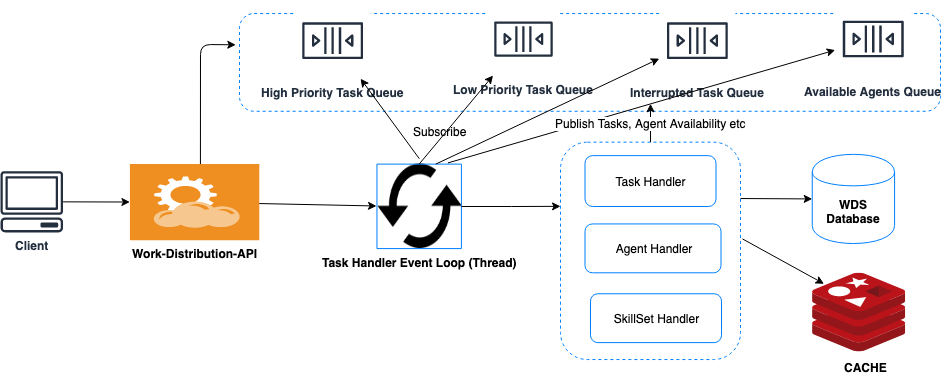
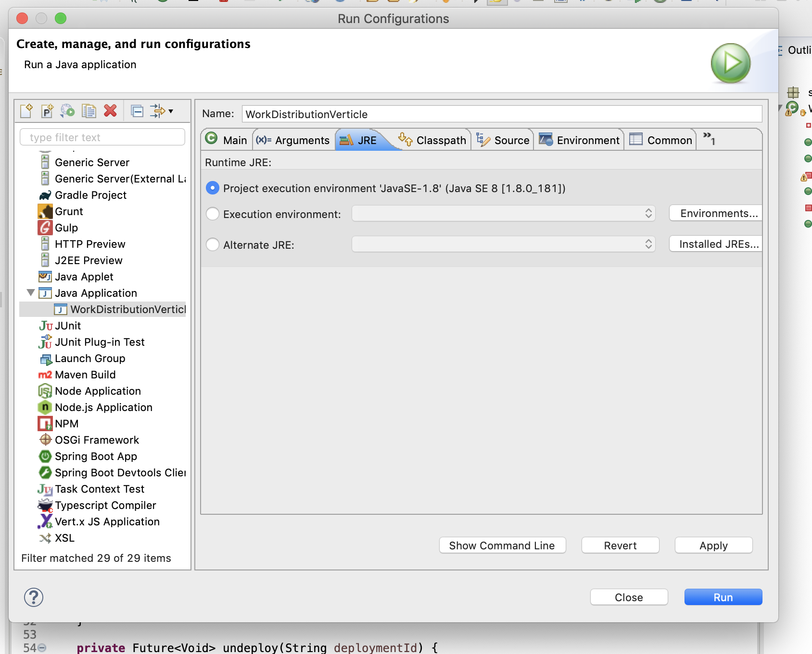
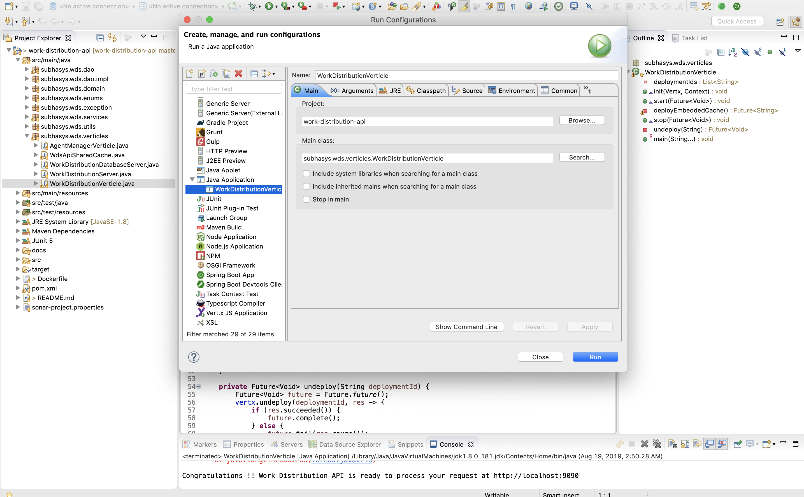

Event Driven RESTful API
========================

@author : [Subhasis Samal](https://www.linkedin.com/in/subhasis-samal)
# An Event Driven RESTful API using Vertx with basic CRUD Operation


### Technology Stack
1. Vertx 3.x
2. Java 8
3. MongoDB (Database)
4. Redis (Cache)
5. Docker (Container)
6. Junit (Testing)
7. Mockito
8. Maven (Build)

## Build and Deployment
* **MongoDB installation and Test Data Set Up**
1. Refer the instructions to install MongoDB : https://docs.mongodb.com/manual/installation/
2. Make sure Mongo DB is running on the default port 27017
```
$ mongod -dbpath data/db/
```

3. Insert Agent related data with this query  db.agents.insert() and passing the agent data present in this file- [agentData.json](docs/agentData.json)

* **Eclipse IDE Installation** https://www.eclipse.org/downloads/
* Maven Installation : https://maven.apache.org/install.html

* **Clone the Repo from GitHub**
```
$ git clone https://github.com/subhasam/work-distribution-api.git

$ cd work-distribution-api
$ mvn clean install
```
* **To run in IDE - Import the source code in Eclipse IDE and add the Run Configurations**  and 


* **Steps for Installation through Docker(WORK IN PROGRESS)**

```
$ git clone https://github.com/subhasam/work-distribution-api.git

$ cd work-distribution-api

$ mvn clean install 

$ docker-compose build

$ docker-compose up
```

* **_After install wait until the below message appears in the console which means API is ready to process you request._**

```
Congratulations !! Work Distribution API is ready to process your request at http://localhost:9090
```

## API Status Check: 
Hit this URL on browser or through any REST Client, you will see a response from the server.
```
http://localhost:9090/workdistribution/v1/health-check
RESPONSE : Health-Check : Work Distribution API is Up Running...
```
## Testing the Work Distribution API

You can use any Rest Client of your choice like Postman/Insomnia/Chrome's Rest Client Extension to test the API.
_For every request except Health check, you need to pass an attribute "access_token" with any value in the Header for authentication._
```
access_token: subhasis
```
API End Points :
================

| METHOD |            End-Point               |    Description          |  Test Data/Request-Response Reference                                      |
|--------|------------------------------------|-------------------------|-----------------------------------------------------------|
| GET    | /workdistribution/v1/health-check  | API Health Check        | [ApiHealthCheck.json](docs/WdsApiHealthCheck.json)  |
| GET    | /workdistribution/v1/skills        | Lists Available Skills  | [AvailablesSkills.json](docs/WdsApiAvailablesSkills.json) |
| POST   | /workdistribution/v1/tasks         | Create a Task           | [TaskCreationReqRes.json](docs/WdsTaskCreationReqRes.json)|
| PATCH  | /workdistribution/v1/tasks/taskId| Mark a Task as Complete | [MarkTaskComplete.json](docs/WdsMarkTaskComplete.json)    |
|        |                                    | Common Errors           | [Common-API-Errors.json](docs/WdsInvalidRequestRes.json)  |

## API Sample Request and Response
Sample Test Data - Request and Response are listed under "docs" directory.

## Work-In-Progress and Future Enhancements

* Docker Mongo Connectivity Fix
* Enable Unit Tests and Add Test Clients
* Logging
* Redis Connectivity Issue Fix
* Integration with Message Queue(Active MQ)/Streaming Middleware(Kafka)
* Event Bus with Verticles Developed in Multiple Languages
* Integration with PostgreSQL
* Integration with SaaS
* Integration with CouchBase
* EventBus Additional Microservices
